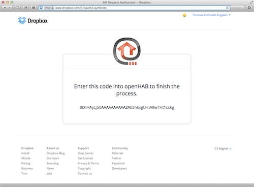

Documentation of the Dropbox IO Bundle

## Introduction

The Dropbox IO bundle is available as a separate (optional) download.
If you want to enhance openHAB with an integration to your personal Dropbox, please place this bundle in the folder `${openhab_home}/addons` and configure it to your needs. See the following sections on how to do this.

The intended main use cases are backing up openHAB configuration and log files to a version able cloud space and transporting changed files back to openHAB after editing them with the openHAB Designer on the Administrator's Desktop PC.

## Prepare your Dropbox

First, you have to create a Dropbox-App. Call the URL: https://www.dropbox.com/developers/apps

Click 'create app'

Choose:
- 'Dropbox API app'
- 'Files and datastores'
- 'No My app needs access to files already on Dropbox.'
- 'Specific file types My app only needs access to certain file types, like text or photos.'
- 'Text files TXT, Markdown, Code files, HTML, etc.'

Now, give it a name.

If your new App is created, copy the 'App key' and 'App secret' in the field of the openhab.cfg file.

## Authentication

You'll have to authorize openHAB to connect to your Dropbox. This is done in a three step process. openHAB requests a token which is used as a one-time-password to get hold of an access token (second step) which will be used for all future requests against Dropbox.

**Step 1** is issued by openHAB automatically. You will find some log entries like this:

    17:04:35.375 INFO  o.o.i.d.i.DropboxSynchronizer[:202] - #########################################################################################
    17:04:35.376 INFO  o.o.i.d.i.DropboxSynchronizer[:203] - # Dropbox-Integration: U S E R   I N T E R A C T I O N   R E Q U I R E D !!
    17:04:35.376 INFO  o.o.i.d.i.DropboxSynchronizer[:204] - # 1. Open URL 'https://www.dropbox.com/1/oauth2/authorize?locale=en_US&client_id=gbrwwfzvrw6a9uv&response_type=code'
    17:04:35.376 INFO  o.o.i.d.i.DropboxSynchronizer[:205] - # 2. Allow openHAB to access Dropbox
    17:04:35.376 INFO  o.o.i.d.i.DropboxSynchronizer[:206] - # 3. Paste the authorisation code here using the command 'finishAuthentication "<token>"'
    17:04:35.376 INFO  o.o.i.d.i.DropboxSynchronizer[:207] - #########################################################################################

**Step 2** needs interaction. Copy the given URL to your browser and authorize openHAB to use Dropbox in the future. Be aware that the request token is only valid for the next five minutes, so don't be to placid. After successful authorization a token is shown on the Dropbox Webpage.

**Step 3** needs interaction, too. Please copy the token shown on the Dropbox Webpage and issue the following command `finishAuthentication "lsdfgkj03lewkfd987349z3kjh222"` on the OSGi console.

## Sync Modes

There are three different synchronization modes available

- `DROPBOX_TO_LOCAL` - changed files will be downloaded from your Dropbox to openHAB only
- `LOCAL_TO_DROPBOX` - locally changed files will be uploaded to your Dropbox only
- `BIDIRECTIONAL` - files will be synchronized from Dropbox to your local openHAB and vice versa. All changes will be downloaded from Dropbox to your local system first. After that any local changes will be uploaded to Dropbox. Hence a concurrent change to one file will be overruled by Dropbox in any case.

In case your Dropbox returns the `reset` flag and your local configuration of `dropbox:initialize` is set to `true` all local files will be uploaded to your Dropbox once, even if your synchronization mode is set to `DROPBOX_TO_LOCAL`. The `reset` flag might be returned either if the synchronization has been the first call ever (so no delta cursor is available) or there might be technical issues at Dropbox which causes the connected clients to resynchronize their states with Dropbox again.

## Schedules

The Dropbox IO Bundle supports different schedules for each synchronization direction. E.g. one could backup the configuration- and log files once a day (preferably at night 2-4am) whereas configuration changes should be downloaded every minutes. Such configuration can be accomplished by two [Cron expressions](http://quartz-scheduler.org/documentation/quartz-2.1.x/tutorials/tutorial-lesson-06) (see `openhab_default.cfg` for more information on these parameters).

The default schedule is set to every five minutes for download and once day at 2am for upload.