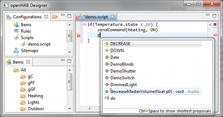

# How to use scripts in openHAB

# Introduction

openHAB comes with a very powerful expression language, which can be used to define scripts. A script is a code block that can be defined by the user and which can be called and thus reused from different places.

# Defining Scripts

## File Location

Scripts are placed in the folder `${openhab.home}/configurations/scripts`. The runtime already comes with a demo file called `demo.script`. The filename defines the name of the script (without its extension) for references.

## The Syntax

The expression language used within scripts is the same that is used in the Xtend language - see the [documentation of expressions](http://www.eclipse.org/xtend/documentation.html#Xtend_Expressions) on the Xtend homepage.

The syntax is very similar to Java, but has many nice features that allows writing concise code. It is especially powerful in handling collections. What makes it a good match for openHAB from a technical perspective is the fact that there is no need to compile the scripts as they can be interpreted at runtime.

## Variables and Functions

To be able to do something useful with the scripts, openHAB provides access to 
- all defined items, so that you can easily access them by their name
- all enumerated states/commands, e.g. `ON, OFF, DOWN, INCREASE` etc.
- all [standard actions](Actions) to make something happen

Combining these features, you can easily write code like
    if(Temperature.state < 20) {
    	sendCommand(Heating, ON)
    }

## IDE Support

The openHAB Designer offers full IDE support for scripts, which includes syntax checks and coloring, validation with error markers, content assist (Ctrl+Space) etc. This makes the creation of scripts very easy!

# Calling Scripts

A script is identified by its filename. If the filename is `demo.script`, the script name is simply `demo`.
Every script has a return value, which is the result of the last expression in it (and might be `null`).

Scripts can be called from different places:
- From within rules through the *`callScript("<scriptname>")`* [action](Actions).
- From a calendar entry in your Google calendar - just put *`> callScript("<scriptname>")`* in the entry
- From inside the XMPP console by typing *`> callScript("<scriptname>")`*

Note that you can put any expression behind the ">" sign, calling a script is just one option. Therefore you could ask for the current temperature in the XMPP console like this:
    > Temperature.state

In future, there might also be the possibility to use scripts for transformations (e.g. for defining label texts) or in command mappings.